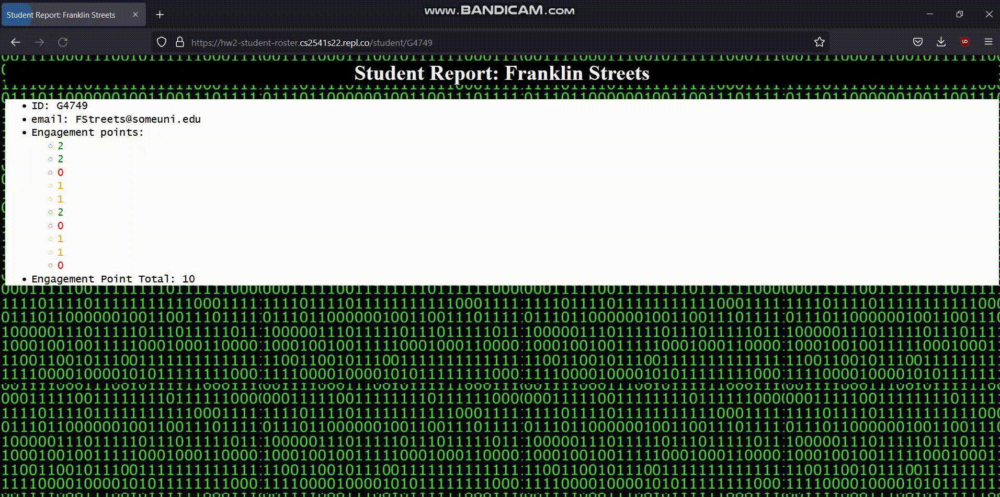

## Instructions  

Techniques: Python, Flask, Templates, HTML, CSS 

<blockquote>
For this assignment you must build a student roster application that shows a list of students and gives details about each one. It is similar to Lab 2, but adds some extra features and changes how you get the data.

**This is an INDIVIDUAL assignment.** You may reuse some of the code from your Lab 2, but you may not work with those students (or any others) to complete the assignment.

**Project URL:** [https://replit.com/team/gwucs2541sp23/HW2-Student-Roster](https://replit.com/team/gwucs2541sp23/HW2-Student-Roster)

**Deadline:** Friday January 28th 11:59PM. Remember to hit *Submit!*

**Hint:** The [Lab 2 slides and Instructor Playground Replit](/lab2) have a lot of useful information on using Flask templates! You should be using template syntax for `if` statements, `for` loops, and access to dictionary values!
</blockquote>

## Requirements
Your website should contain three types of pages:

 1. Home page (`/`): Should display a list of students in the class by name. Clicking on a student's name should take them to a student data page
 2. Student Data page: This should display a report about a specific student including:
    - Full name
    - ID number
    - Email address
    - Engagement points by week - each student has a list representing how many engagement points they have earned per week over the course of 10 weeks. You should display each entry and color code it as follows: green if they received 2 points, orange for 1 point, or red for 0 points
    - Total engagement points - display the total points they have earned over all ten weeks
3. Author page (`/author`): This page should simply return your full name to help with grading.

Your site must use Python Flask Templates to display the top two types of pages.  **You must use CSS** to change the default styling, and you should use CSS classes to change the color of engagement point entries. Let your creativity guide you.

## Accessing Student Data

To get access to the student data, you must use the provided `StudentDB` class -- this will mimic interacting with a database. You **may NOT** define your own students like you did in Lab 2!

The StudentDB class provides an API to get information about students:

```python
 def get_students(self):
    """
    Get a List of all students. Each student is stored as a dictionary with keys for id, name, email, and a List of engagement point values.
    """

  def get_student(self, id):
    """
    Return a dictionary representing a specific student by their ID number
    """
  ```

The first function returns a List with all students in the class, while the second will return a specific student based on their ID number. If you aren't familiar with Python class syntax such as the `self` keyword, check [Full Speed Python's Chapter 8](https://github.com/joaoventura/full-speed-python/releases/download/v0.4.3/full-speed-python.pdf). Here is sample usage:

```python
from studentDB import StudentDB

# Create a fake DB with 10 students
studentsDB = StudentDB(10)

# get a List of dictionaries representing all students
all_students = studentsDB.get_students()
print(all_students)

# get a dictionary for a specific student (must be a valid ID)
s = studentsDB.get_student("G5545")
print(s["engagement"])
```

You may only interact with the StudentsDB class by using the two functions defined above. We encourage you to look at the `studentDB.py` file to see how this is implemented, but **you may not modify that file.** 

## Example
Here is an example of what your site might look like when done:

  

