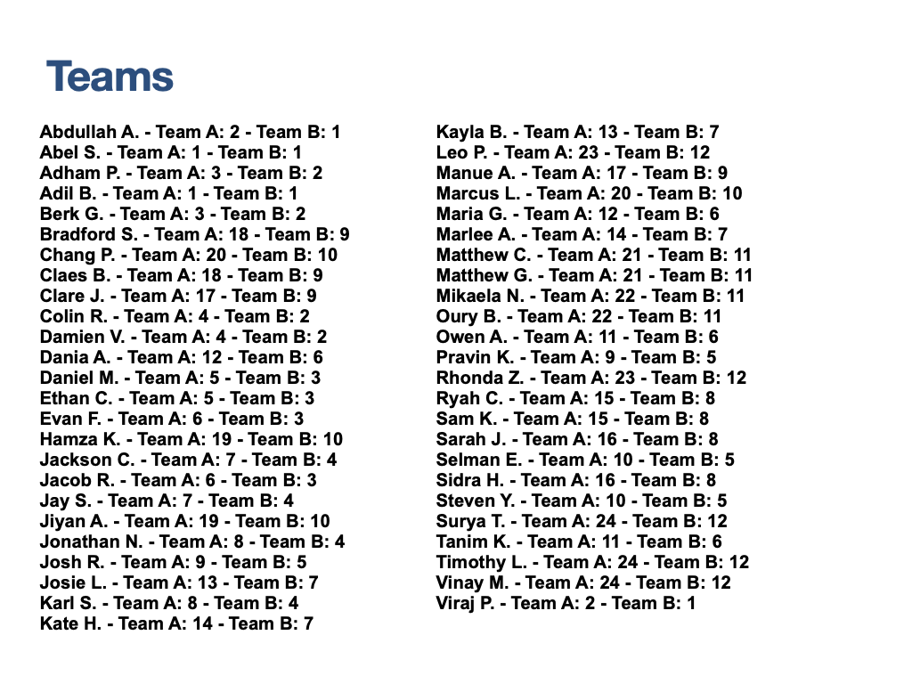

> This lab will teach you the basics of HTML and CSS. No advance knowledge of either is required, but if you are not already familiar with HTML, we strongly suggest you complete the Pre-Lab exercise below **before** class.

# Pre-Lab Exercise

**Time Estimate:** 30 minutes 
**Deadline:** Week 1, Wednesday 12:45PM (before class)

To be fully prepared for lab, we suggest students do a Pre-Lab. As an incentive for this week, we will give you an Engagement point (see syllabus for details) if you complete the pre-lab exercise before class starts on Wednesday.

To complete the Pre-Lab, you must:
  - Join our [Slack Message board](https://join.slack.com/t/cs2541databasess22/signup)
  - Get an account for [replit.com](https://replit.com) (we suggest using your github account to login)
  - Join our [Replit classroom](https://replit.com/teams/join/gukqdwogyqbmppgeaxpnsjzsyamvqwmg-cs2541s22) 
  - Complete the [Welcome Survey](https://forms.gle/n8NQLQPSAnJxzogZ6)
  - Solve [Pre-Lab1: Hello World Wide Web](https://replit.com/team/cs2541s22/Pre-Lab1-Hello-World-Wide-Web) on replit

To solve the lab, you must fully follow the Instructions to make a Hello World webpage, which should be visible when you open the project. You do not need to record your answers to the *italicized questions*, but you might want to take notes since you will be expected to know this information later! You do have a plan for making class notes, right??

> Note that pre-labs will not be graded. They are designed to give you practice so that you are prepared for class, and in some cases (like this one) will give you an opportunity to earn an Engagement point.

# Lab 1 Activities
[Pre-Lab1 Hello World Wide Web](https://replit.com/team/cs2541s22/Pre-Lab1-Hello-World-Wide-Web): basics of HTML tags, nesting, validation and DOM
  - not graded, due today for participation point

[Lab1 Practice Student Roster](https://replit.com/team/cs2541s22/Lab1-Practice-Student-Roster): try to make a page with a list of student names
  - **Team A**: not graded, see what you can figure out!

[Lab1 Practice Lots of Tags](https://replit.com/team/cs2541s22/Lab1-Practice-Lots-of-Tags): walk through of most common HTML tags and CSS
  - not graded, follow along as we discuss

[Lab1 Student Bios](https://replit.com/team/cs2541s22/Lab1-Student-Bios): work in a small group to make a website with CSS styling
  - **Random Replit Teams**: DUE Tuesday 1/18 at 11:59PM (usually will be a shorter deadline)

<!-- # Lab 1 Teams

 -->